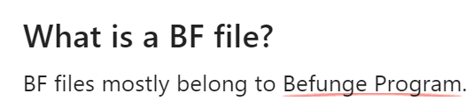
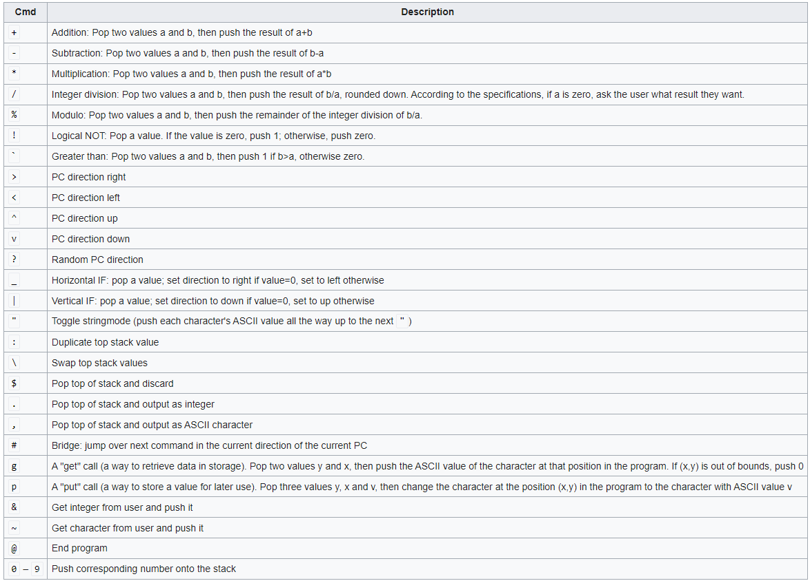
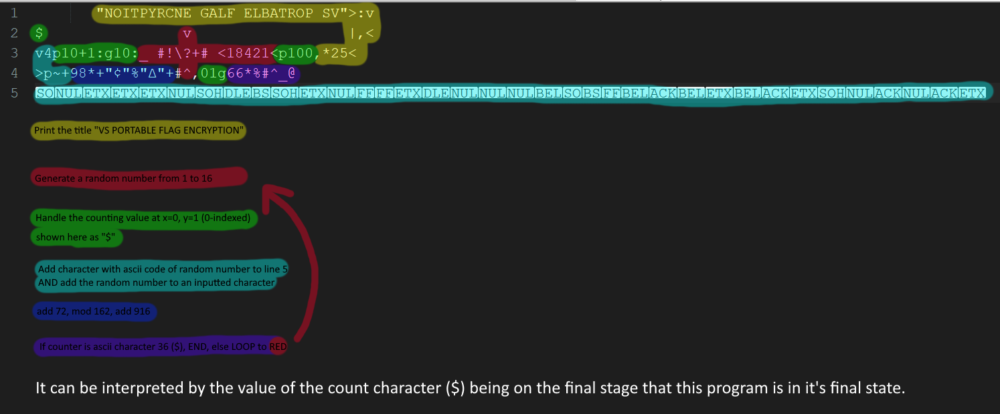

# Writeup

1. We are given a `.bf` and a text file, both of which can be opened by a regular text editor. The `.bf` file extension should tell us that this challenge is written in the `Befunge` esolang.



Befunge's syntax and documentation can be found very easily online: 
- https://en.wikipedia.org/wiki/Befunge
- https://esolangs.org/wiki/Befunge
- http://www.nsl.com/papers/befunge93/befunge93.htm
- https://github.com/catseye/Befunge-93/blob/master/doc/Befunge-93.markdown



2. Using this information, we can begin to parse the given code:
   

(more information on parsing can be found at the bottom of this writeup)

3. The `aqua`, `blue`, and `purple` parts are the main cryptographic functions we have to reverse, and they are pretty simple. Because the `aqua` section leaks the random numbers, everything can be solved externally.

```python
encoded = 'ξέΠαΣεΝПЪвЭΡΫΥТμеЬаГΧιМИΟФΜήГΰбНЭЏЃκ'
key = list(open('crypto.bf', 'rb').read().split(b'\n')[-1])

flag = ''
for e, k in zip(encoded, key):
    inp = ord(e) - 916
    if inp < 72:
        inp += 162
    inp -= 72
    flag += chr(inp - k)

print(flag)
```

This prints: `vsctf{b3FUNge_CrYPT0_w45_A_m1sTAK3!}`

## Extension

The difficulty in this challenge comes from parsing the Befunge code, which I glossed over in the main section of this write-up. Here I will elaborate on how to parse the logic for yourself. Use the image from `step 2` as a guide.

### Yellow

The text is fed to the interpreter backwards to put the first character at the top of the stack. To print out the stack, we use `:` to duplicate the character, use `,` to print it out, then `|` to check if the duplicated letter is zero (which would mean there are no more characters to print). Afterwards, `,*25<` adds a newline character to the end

### Red

I used a modified version of [this snippet](https://github.com/catseye/Befunge-93/blob/master/eg/rand15.bf) to get somewhat random numbers in this section. This works by going through a set of numbers, then using the `?` character to randomize which characters are added up to the final random number. I used pointer characters (`^>v<`) to somewhat control where the pointer goes, and `_` to check whether there are any numbers left to add. The `#` is used to prevent the `+` or `\ ` symbols from being triggered on the way in, but not on the way out.

### Green

These parts of the code just have to do with grabbing and writing to data from the coordinates `(0, 1)`. Because Befunge is Zero-Indexed, this refers to the first character on the second line. Later in the code, this counter is used for things like determining where the hints from aqua are placed and determining if the program is finished.

### Aqua

This code places a copy of the generated random number at `(x, 4)` where `x` is the value of the counter. I used the counter here in order to prevent data overlap and to indicate which part of the key each value represents. I then get an inputted character using `~`, then add the character together with the random value I generated with `+`.

### Blue

`98*` adds the number `72` to the stack, then `+` adds it to the inputted character. `"¢"` just gets the ascii ordinal of the `¢` character, which can be found with the python command `ord('¢')`, giving us `162`. Finally, the `Δ` character (`916`) is also added, just to top it off.

### Purple

I grab the count number with `01g` and the hard-coded final length (36) `66*` and modulus them together, an operation that will return 0 if the count has reached 36. In the `#^_@` code, the `#` jumps to the `_`, which goes right (to the `@`, ending the program) if the zero is reached, and goes left otherwise (continuing the loop). 